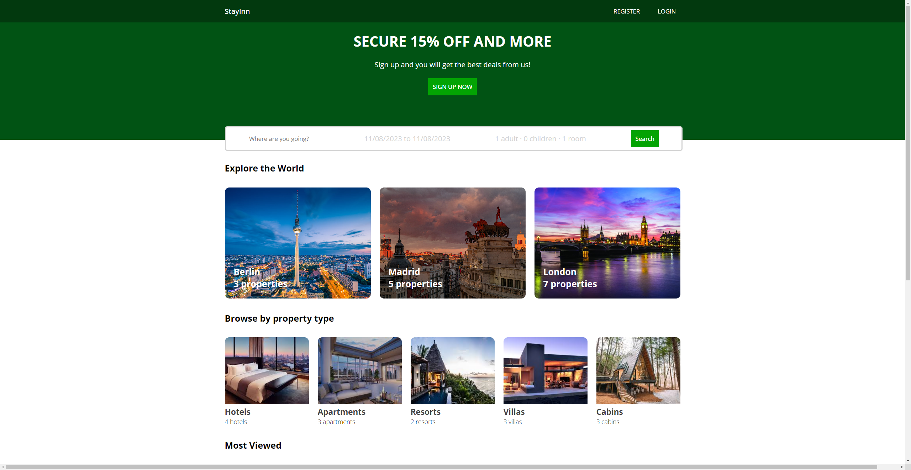
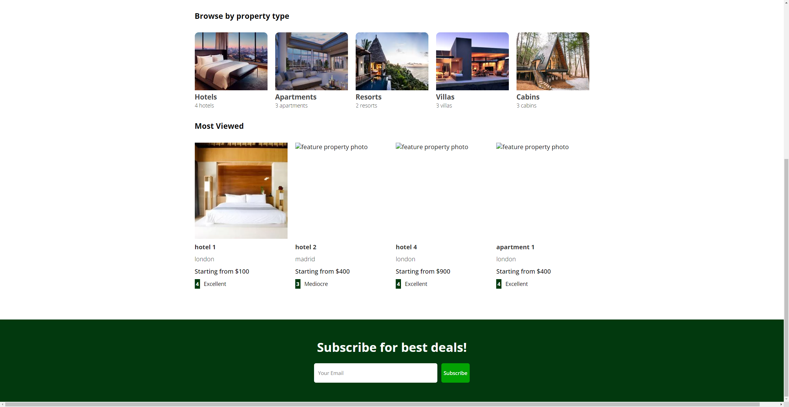
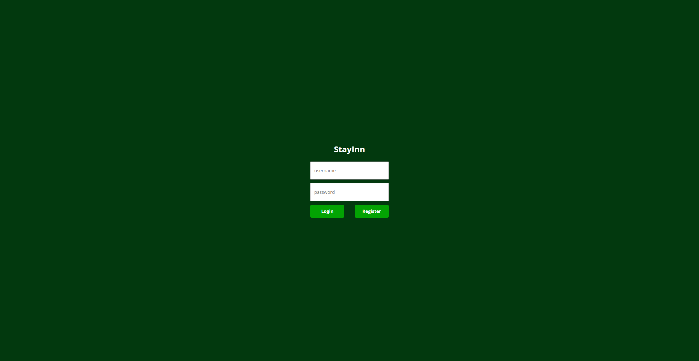
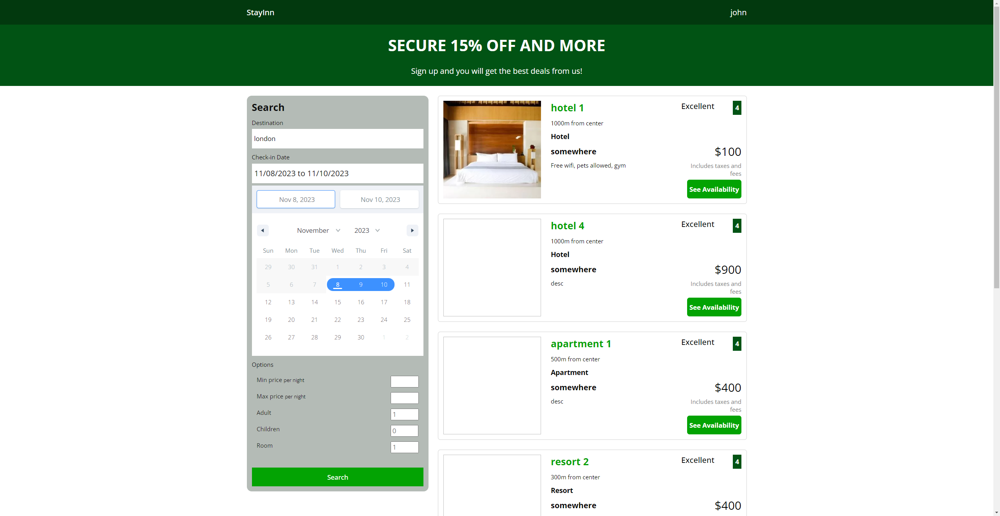
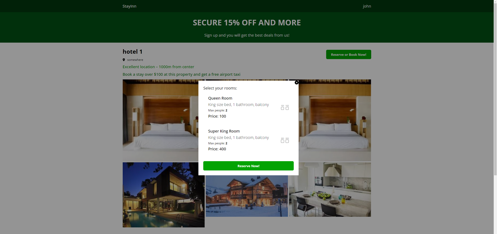

## StayInn - Web Booking Application

### Project Objective
This is a full-stack web-based hotel booking platform designed to offer a seamless and interactive experience for users looking to book accommodations. Leveraging the power of AJAX for smooth, asynchronous web page updates, React for a responsive UI, and MongoDB for efficient data handling, we aim to deliver a hassle-free booking experience.

### Authors
* Congkai Sun
* Yue Huang

### Functionalities
* User Authentication: Secure user authentication system.Users can sign up, log in.
* Real-Time Search and reserve: Real-time search results and filtering options based on location, price, and max people. Users can reserve a hotel from the results.
* Detailed Hotel Information: Each listing will provide detailed information, including images, room availability.

### Instruction to build
* Download this project as zip file or clone to your own gits
```
cd client => yarn install or npm install => yarn start or npm start
cd api => yarn install or npm install => yarn start or npm start
```
* Place the .env file in the api folder

### Design Document
[Project 3 - StayInn-  Web Booking App.pdf](https://github.com/CERKO12/StayInn--Web-booking-application/files/13304354/Project.3.-.StayInn-.Web.Booking.App.pdf)

### Class Link
[CS5610-Web Development](https://johnguerra.co/classes/webDevelopment_fall_2023/)

### Screenshots
StayInn homepage



Login / Registration


Search lists


Reserve page

